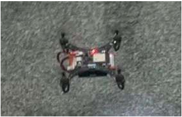
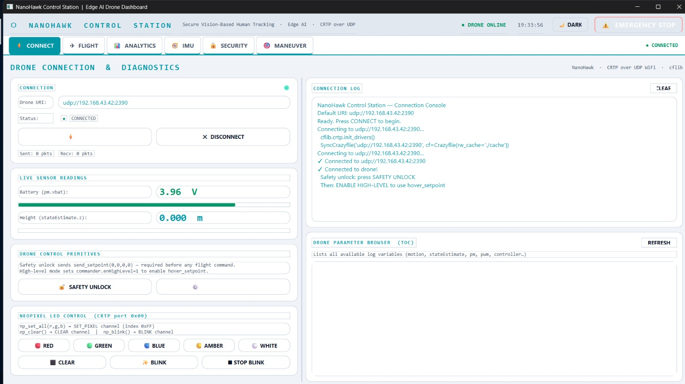
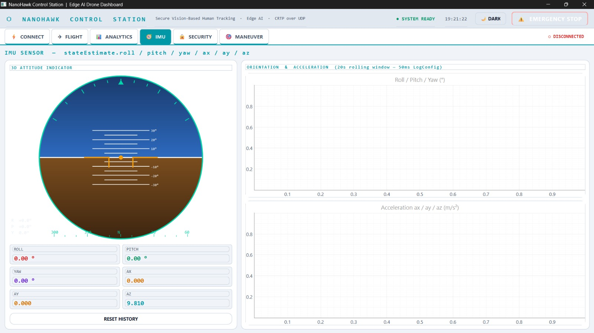
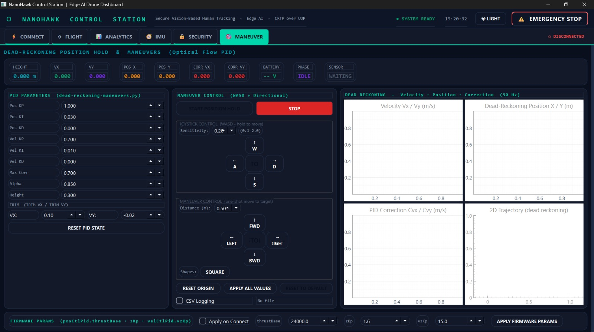
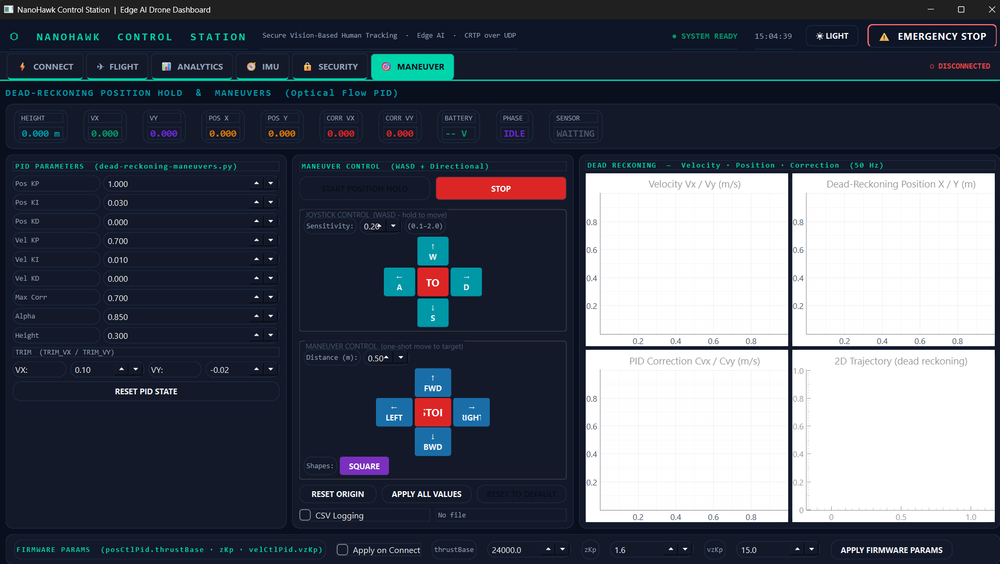
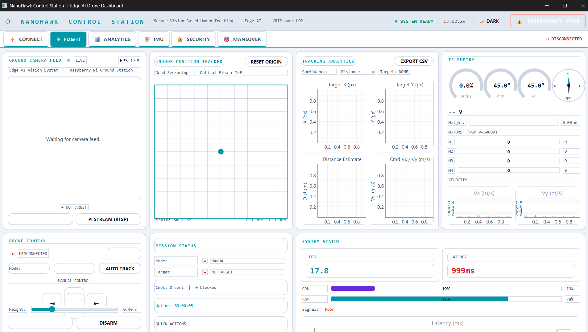
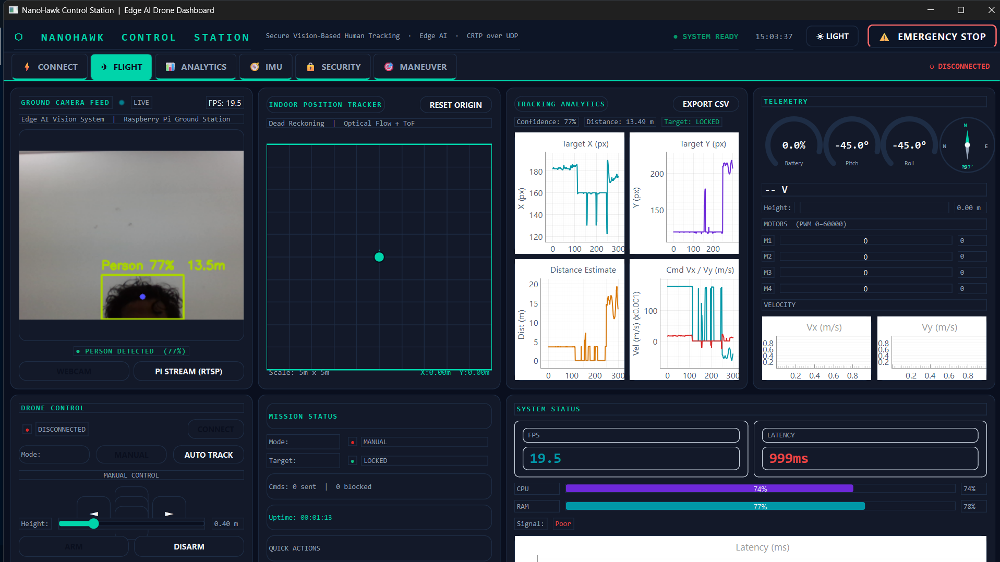

<div align="center">



# NanoHawk Control Station

### Secure UAV Ground Control System with AI-Powered Object Tracking

[](https://www.python.org/)
[](https://www.riverbankcomputing.com/software/pyqt/)
[](https://ultralytics.com/)
[](https://opencv.org/)
[](https://www.bitcraze.io/)
[](LICENSE)
[](https://www.microsoft.com/)

---

**NanoHawk** is a full-featured ground control station (GCS) for the LiteWing nano-drone platform, built as a final-year engineering project. It combines real-time telemetry, AI-based person tracking, optical-flow dead-reckoning position hold, and HMAC-SHA256 secured command authentication — all wrapped in a polished PyQt6 dashboard.

[Features](#-features) · [Architecture](#-architecture) · [Tech Stack](#-tech-stack) · [Screenshots](#-screenshots) · [Getting Started](#-getting-started) · [Development Phases](#-development-phases) · [Reports](#-reports)

</div>

---

## ✨ Features

| Module | What it does |
|---|---|
| 🔗 **Connect Page** | URI configuration, battery monitor, ToF sensor readout, Table of Contents (TOC) browser, safety unlock sequence |
| 🚁 **Flight Page** | Live camera feed, YOLOv8 person tracking, 2D map view, full telemetry panel, mission controls |
| 📊 **Analytics Page** | Optical-flow EMA graphs, 2D position tracker plot, real-time cflib ground-station style charts |
| 🧭 **IMU Page** | Roll / Pitch / Yaw + Ax / Ay / Az live plots, custom 3D artificial horizon widget (QPainter) |
| 🔒 **Security Page** | HMAC-SHA256 audit log, replay attack counter, range-check violation log |
| 🎮 **Maneuver Page** | Dead-reckoning PID position hold, WASD joystick control, waypoint maneuvers, CSV flight logging |

---

## 🏗 Architecture

```
┌─────────────────────────────────────────────────────┐
│                   PyQt6 Main Window                 │
│  ┌──────────────────────────────────────────────┐   │
│  │            QStackedWidget (6 pages)          │   │
│  │  Connect │ Flight │ Analytics │ IMU │        │   │
│  │  Security │ Maneuver                         │   │
│  └──────────────────────────────────────────────┘   │
└────────────────────┬────────────────────────────────┘
                     │ MainController
     ┌───────────────┼──────────────────┐
     ▼               ▼                  ▼
CameraService    DroneService      SecurityService
(QThread)        (QThread)         (validates every cmd)
     │               │
     ▼               ▼
YoloService      cflib ──► LiteWing Drone
(QThread)        (UDP 192.168.43.42:2390)
                     │
              ┌──────┴──────┐
              ▼             ▼
        imu_updated    state_updated
        (signals)      (signals)
              │             │
         ImuPage      All Telemetry
                       Panels
```

**Signal flow is one-way** — services push data to the UI via Qt signals. The UI never calls into services directly except through the controller. This keeps the drone thread isolated from the main thread completely.

---

## 🛠 Tech Stack

| Layer | Technology | Version | Purpose |
|---|---|---|---|
| **GUI Framework** | PyQt6 | ≥ 6.5 | All UI, threading, signals/slots |
| **Drone SDK** | cflib (Crazyflie) | ≥ 0.1.25 | CRTP protocol, logging, parameters |
| **Object Detection** | Ultralytics YOLOv8 | ≥ 8.0 | Real-time person detection + distance estimation |
| **Computer Vision** | OpenCV | ≥ 4.8 | Camera capture, frame processing, colour tracking |
| **Plotting** | PyQtGraph | ≥ 0.13.3 | Real-time telemetry charts (GPU-accelerated) |
| **Security** | Python `hmac` + `hashlib` | stdlib | HMAC-SHA256 command authentication |
| **System Monitor** | psutil | ≥ 5.9 | CPU / RAM / disk metrics panel |
| **Numerics** | NumPy | ≥ 1.24 | PID, optical-flow velocity calculations |
| **Language** | Python | 3.11+ | Entire codebase |

### Hardware

| Component | Spec |
|---|---|
| **Drone** | LiteWing nano-UAV (Crazyflie-compatible) |
| **Communication** | UDP over Wi-Fi hotspot (192.168.43.42:2390) |
| **Optical Flow** | 5.4° FoV, 30-pixel resolution flow sensor |
| **Height Sensor** | Time-of-Flight (ToF) — z-range |
| **Camera** | USB webcam / onboard stream |
| **Host** | Windows 11, Python 3.11 |

---

## 📸 Screenshots

> **v2 Dashboard**

### Main Dashboard


### Maneuver Page — Dead-Reckoning PID Control


### Controller View




### Flight Page — Live Camera + YOLOv8 Tracking


### Flight Page v1


> Add more screenshots to [`reports/screenshots/`](reports/screenshots/)

---

## 🚀 Getting Started

### Prerequisites

- Python **3.11+**
- Windows 10/11 (winsound used for disconnect audio alerts)
- LiteWing / Crazyflie drone on hotspot **192.168.43.42**

### Installation

```bash
# Clone the repo
git clone https://github.com/codehat01/autonomous-drone-gui.git
cd autonomous-drone-gui

# Create and activate virtual environment
python -m venv venv
venv\Scripts\activate        # Windows

# Install dependencies
pip install -r requirements.txt
```

### Running

```bash
# ALWAYS use the venv Python — system Python has a numpy ABI mismatch with cv2
venv\Scripts\python.exe main.py
```

> **Important:** Never run `python main.py` directly with the system Python if you have numpy 2.x installed globally. It will crash with a numpy ABI error. Use the venv.

### Configuration

Edit [`utils/config.py`](utils/config.py) to change:

```python
DRONE_URI    = "udp://192.168.43.42:2390"   # drone hotspot IP
TARGET_HEIGHT = 0.3    # metres
MAX_SPEED     = 0.4    # m/s
```

---

## 📐 How It Works

### Dead-Reckoning Position Hold (PID)

The ManeuverPage implements a dual-loop PID controller derived from `dead-reckoning-maneuvers.py`:

```
Optical Flow sensor → delta_x, delta_y (pixels)
       ↓
velocity = delta * altitude * (FOV_rad / resolution / DT)
       ↓
IIR smoothing (α = 0.85)
       ↓
Dead-reckoning integration → pos_x, pos_y
       ↓
Position PID (Kp=1.0, Ki=0.03, Kd=0.0)
  + Velocity PID (Kp=0.7, Ki=0.01, Kd=0.0)
       ↓
correction_vx, correction_vy → DroneService.send_hover_setpoint()
```

Anti-windup clamps the integral to ±0.1. Drift compensation bleeds position estimate toward zero at 0.004 m/s when stationary. Periodic resets every 90 seconds prevent accumulation errors.

### YOLOv8 Person Tracking + Distance Estimation

```
Camera frame (BGR) → YoloService (QThread)
       ↓
YOLOv8 inference — class 0 (person) only, highest confidence
       ↓
Thin-lens formula:  distance = (FOCAL_LENGTH_PX × AVG_PERSON_HEIGHT_M) / bbox_height_px
       ↓
TrackingController → velocity commands to keep person centred
       ↓
annotated_frame signal → FlightPage camera display
```

### HMAC-SHA256 Command Security

Every velocity command is signed before being sent to the drone:

```
payload = struct.pack("fffd", vx, vy, height, nonce)
token   = HMAC-SHA256(secret_key, payload)
```

`ReplayDetector` maintains a 5-second sliding nonce window and rejects:
1. Duplicate nonces (replay attacks)
2. Timestamps older than 5 seconds
3. Future-dated commands (more than 2 seconds ahead)

`CommandValidator` range-checks every command — `vx/vy` capped at `MAX_SPEED = 0.4 m/s`, height bounded between 5 cm and 1.5 m.

---

## 🗺 Development Phases

This project was built iteratively over several months as a final-year engineering project. Here's how it came together:

### Phase 1 — Hardware Familiarisation & Python Scripts
We started with the raw LiteWing Python scripts — connecting to the drone over UDP, reading telemetry via cflib, and understanding the CRTP protocol. Scripts like `hellow_litewing.py`, `battery_voltage_read.py`, and `ToF-Read.py` were our first contact with the hardware. Getting a stable connection was the first real challenge.

### Phase 2 — Flight Control Algorithms
Once we had reliable comms, we built and tested the core flight algorithms in standalone scripts:
- `dead-reckoning-position-hold.py` — dual-loop PID using optical flow
- `height-hold-joystick.py` — ToF-assisted altitude hold
- `dead-reckoning-maneuvers.py` — full waypoint maneuver logic with NeoPixel LED feedback
- `auto-take-off-with-height-hold-joystick-control.py` — safe takeoff sequence

Each script was tested on real hardware before being ported into the GUI.

### Phase 3 — GUI Foundation (PyQt6)
We moved everything into a proper PyQt6 application. The architecture was designed from the start to keep drone threads completely isolated from the UI via signals. The `QStackedWidget` page system, `DroneService` QThread, and `MainController` signal wiring were all established in this phase.

### Phase 4 — AI Integration
YOLOv8 (Ultralytics) was integrated as a separate `YoloService` QThread so inference never blocks the UI. The `CameraService` feeds frames into `YoloService`, which emits annotated frames and `TrackingData` back to the flight page. Distance estimation from bounding box height was calibrated against real captures.

### Phase 5 — Security Layer
The security module was designed around three concerns: authentication (`TokenManager` — HMAC-SHA256), replay prevention (`ReplayDetector` — sliding nonce window), and range validation (`CommandValidator`). The SecurityPage provides a live audit log of every command verification result.

### Phase 6 — Polish & Final Integration
- All pages wrapped in `QScrollArea` so panels never clip on smaller screens
- Full light-theme stylesheet applied across all widgets
- `ToastNotification` with `winsound.Beep` audio alert on drone disconnect
- `AttitudeWidget` — custom QPainter artificial horizon with 3D drone silhouette
- `SystemMonitor` panel for CPU/RAM/disk
- Analytics page with EMA-smoothed flow plots and 2D position tracker
- `DEMO_MODE=False` enforced so panels show "Connect Drone First" rather than fake data

---

## 📁 Project Structure

```
drone_gui/
├── main.py                    # Entry point — DEMO_MODE flag lives here
├── requirements.txt
├── controllers/
│   ├── main_controller.py     # Wires all services → UI signals
│   └── tracking_controller.py # Person-tracking velocity commands
├── services/
│   ├── drone_service.py       # cflib QThread — all drone comms
│   ├── camera_service.py      # Camera capture QThread
│   ├── yolo_service.py        # YOLOv8 inference QThread
│   ├── security_service.py    # Wraps token + replay + validator
│   ├── colour_tracker.py      # HSV colour tracking fallback
│   └── system_monitor.py      # psutil CPU/RAM metrics
├── ui/
│   ├── main_window.py         # QMainWindow + QStackedWidget
│   ├── pages/
│   │   ├── connect_page.py    # Page 0 — connection & TOC browser
│   │   ├── flight_page.py     # Page 1 — camera, map, telemetry
│   │   ├── analytics_page.py  # Page 2 — graphs & position tracker
│   │   ├── imu_page.py        # Page 3 — IMU plots + horizon widget
│   │   ├── security_page.py   # Page 4 — HMAC audit log
│   │   └── maneuver_page.py   # Page 5 — PID dead-reckoning
│   ├── panels/                # Reusable sub-panels (telemetry, system, etc.)
│   └── widgets/               # Custom widgets (ToastNotification, AttitudeWidget)
├── models/
│   ├── drone_state.py         # DroneState dataclass
│   └── tracking_data.py       # TrackingData dataclass
├── security/
│   ├── token_manager.py       # HMAC-SHA256 sign + verify
│   ├── replay_detector.py     # Nonce sliding-window replay prevention
│   └── command_validator.py   # Speed + height range validation
├── utils/
│   ├── config.py              # All constants — PID, URI, thresholds
│   └── theme.py               # Colour palette + stylesheet helpers
└── reports/
    ├── report/                # NanoHawk_Final_Report.pdf
    ├── paper/                 # NanoHawk_IEEE_Paper.pdf + .tex
    ├── presentation/          # NanoHawk_Presentation.pptx
    ├── assets/                # Architecture diagrams, drone photos, poster
    └── screenshots/           # v2 dashboard screenshots (add yours here)
```

---

## 🔧 Key Configuration Constants

| Constant | Value | Source |
|---|---|---|
| `DRONE_URI` | `udp://192.168.43.42:2390` | LiteWing hotspot |
| `TARGET_HEIGHT` | `0.3 m` | dead-reckoning-maneuvers.py |
| `MAX_SPEED` | `0.4 m/s` | all scripts |
| `POSITION_KP/KI/KD` | `1.0 / 0.03 / 0.0` | dead-reckoning-maneuvers.py |
| `VELOCITY_KP/KI/KD` | `0.7 / 0.01 / 0.0` | dead-reckoning-maneuvers.py |
| `OPTICAL_FLOW_FOV` | `5.4°` | test_optical_flow_sensor.py |
| `TELEMETRY_PERIOD_MS` | `10 ms (100 Hz)` | cflib_groundStation.py |
| `DATA_TIMEOUT` | `0.2 s` | dead-reckoning-maneuvers.py |
| `HMAC_NONCE_WINDOW` | `5 s` | security design |

---

## 📄 Reports & Documentation

| Document | Description |
|---|---|
| [📋 Final Report](reports/report/NanoHawk_Final_Report.pdf) | Complete final-year project report |
| [📝 IEEE Paper](reports/paper/NanoHawk_IEEE_Paper.pdf) | Research paper — Secure UAV communication |
| [📊 Presentation](reports/presentation/NanoHawk_Presentation.pptx) | Project presentation slides |
| [🖼 Architecture Diagram](reports/assets/NanoHawk_Architecture.png) | System architecture overview |
| [🪧 Poster](reports/assets/NanoHawk_Poster.jpg) | Final-year project poster |

---

## 🐛 Known Issues & Notes

- **System Python crash** — If you run `python main.py` without activating the venv and have numpy 2.x system-wide, cv2 will throw an ABI mismatch error. Always use `venv\Scripts\python.exe main.py`.
- **No drone connected** — All panels show "Connect Drone First" by design (`DEMO_MODE=False`). This is intentional — the UI doesn't fake data.
- **YOLO model path** — Set `YOLO_MODEL_PATH` in `utils/config.py` to your local `yolov8n.pt` file before running.
- **Windows only** — `winsound.Beep` for audio alerts is Windows-specific. On other platforms the alert is silent but the toast still shows.

---

## 📚 References

- [Bitcraze Crazyflie Python Library (cflib)](https://github.com/bitcraze/crazyflie-lib-python)
- [Ultralytics YOLOv8 Docs](https://docs.ultralytics.com/)
- [PyQt6 Documentation](https://www.riverbankcomputing.com/static/Docs/PyQt6/)
- [PyQtGraph — Scientific Graphics in Python](https://www.pyqtgraph.org/)
- [LiteWing Platform — Bitcraze](https://www.bitcraze.io/products/litewing/)
- [OpenCV Python Tutorials](https://docs.opencv.org/4.x/d6/d00/tutorial_py_root.html)
- [HMAC — Python stdlib](https://docs.python.org/3/library/hmac.html)
- [psutil Documentation](https://psutil.readthedocs.io/)

---

<div align="center">

Built with 🔥 as a Final Year Engineering Project

**NanoHawk Control Station** — PyQt6 · cflib · YOLOv8 · HMAC-SHA256

</div>
